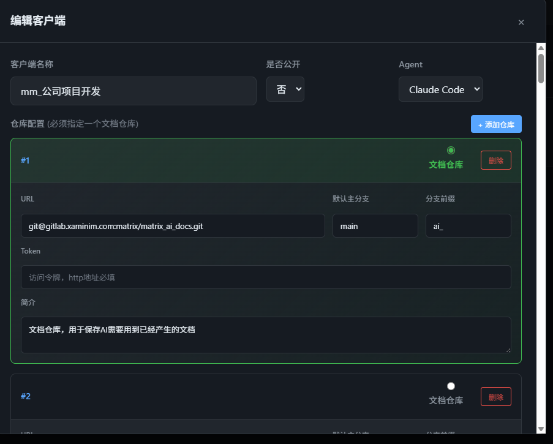
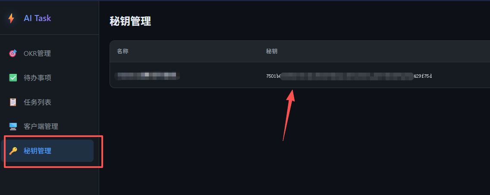
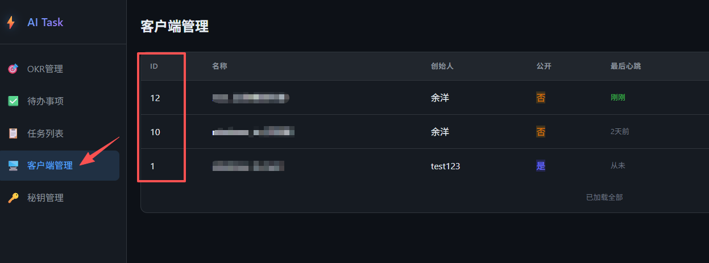
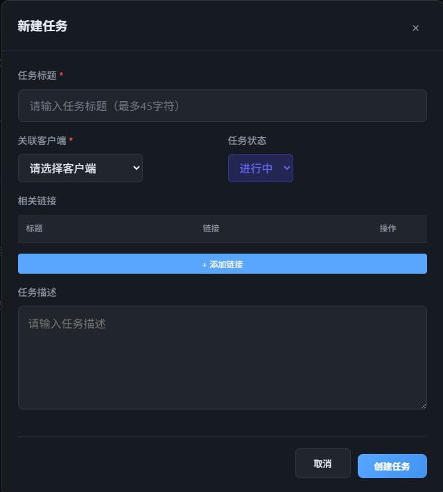
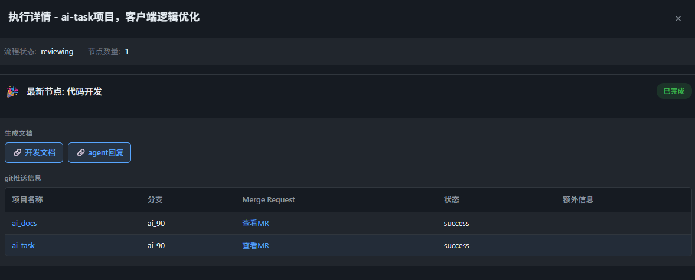

## 目录

- [一、创建客户端](#一创建客户端)
- [二、启动客户端](#二启动客户端)
- [三、创建一个任务](#三创建一个任务)
- [四、任务状态流转以及相关功能说明](#四任务状态流转以及相关功能说明)
- [五、如何快速让同事快速使用自己的配置](#五如何快速让同事快速使用自己的配置)

# 一、创建客户端

1. 客户端名称：客户端展示名称，在创建任务的时候可选

2. 是否公开：如果公开，那么其他人都可以看到这个客户端的配置，以及使用给这个客户端。

   所以公开的客户端，不允许仓库员配置访问令牌token，避免出现泄密

3. agent类型：客户端代码里实际执行的agent类型（之前也说了，当前项目是个agent套壳）

   目前仅支持claude code，未来会逐步支持更多产商的agent，比如开源的opencode、minimax的agent服务

4. 代码仓库配置：

   1. 这里配置这个客户端会用于开发的所有项目，建议是把个人日常开发所涉及到的项目都配置在这里。
   2. 所有的仓库中，必须要选择一个仓库作为文档仓库，agent开发过程中产出的各类文档都会放在这个仓库里，并且任务执行详情页面展示这些文档的快捷链接，方便查看。
   3. 代码仓库的配置项说明：
      1. url 可以配置 git 或者 https 路径
      2. 如果url配置了http 路径，那么必须要填写token
      3. 默认主分支：可以不填写，这种情况下会使用仓库的默认主分支
      4. 分支前缀 prefix：agent开发代码时会创建分支 {prefix}{task.id}
      5. 简介：必填，简单介绍当前项目是做什么的



# 二、启动客户端

找一台机器，安装配置好相应的agent客户端，目前仅支持claude code。

直接下载当前仓库的主分支，或者在发布页面下载最新版本 https://github.com/hduyyg/ai_task/releases

进入下载文件夹的的clients目录，执行如下命令：

``` shell
python main.py -a {apiserver服务地址} -s {客户端验证秘钥} -i {客户端id}
```

参数说明：

1. apiserver服务端地址

   如果是在官网使用，那么直接填写 http://ai_task.yuban.site/ 即可，否则填写你自己私有化部署的后端网址。

2. 秘钥：

   客户利用秘钥访问服务端apiserver做鉴权。
   如果觉得秘钥泄露，那么直接删除对应秘钥即可。

   

3. 客户端id

   第一步创建好的客户端id

   

# 三、创建一个任务

​	在任务列表页面新建一个任务，填写好标题与描述（描述可不填写），状态选择进行中，在第二步中启动的客户端就会获取到这个任务，下载所有的仓库代码，并按照任务描述执行代码开发任务，执行完成之后，点击执行详情即可看到相关的开发文档、代码修改记录。

​	**这里有一个隐蔽逻辑：关联客户端下拉列表展示的是当前用户启动过的客户端**





# 四、任务状态流转以及相关功能说明

1. 客户端只会获取当前状态处于 "进行中" 的任务进行执行
   1.  "执行状态" 是客户端维护的任务状态，代表当前任务执行进展。 
   2. 任务状态总共有：未开始、进行中、挂起、已结束
2. 任务详情：点击查看任务配置信息，比如标题、描述、相关文档等等
3. 执行详情：点击展示agent执行任务的产物，比如开发文档、代码merge request链接
   1. 客户端目前不能直接提交代码merge，因此代码merge的条件条件是一个merge request的搜索链接，需要用户自己提交merge request
4. 删除：软删除任务，界面不可见
5. 重置：软删除当前任务，并以当前任务配置新建一个一模一样的任务，但是任务id与key均不同
6. 执行状态说明：
   1. pending：客户端还未获取到任务
   2. running：客户端获取到任务，正在执行
   3. reviewing：客户端任务执行完成，等待用户审核
      1. 操作列 - 通过：执行状态变更为 reviewed
      2. 操作列 - 修订：用户提交反馈意见，客户端收到反馈意见后进入 revising 状态，按照用户反馈重新执行任务
   4. reviewed：代码开发审核通过，客户端对开发涉及到的每一个git 仓库，整理commit信息并rebase主分支，以便用户可以向leader提交代码合并请求。
   5. revising：客户端正在根据用户反馈，重新执行任务
   6. done：任务执行结束
      1. 操作列 - 修订：用户提交反馈意见，客户端收到反馈意见后进入 revising 状态，按照用户反馈重新执行任务

# 五、如何快速让同事快速使用自己的配置

1. 客户端设置为公开

2. 让同事登录网页端服务，创建秘钥

3. 让同事找一台支持对应agent的机器，在发布页面下载最新版本 https://github.com/hduyyg/ai_task/releases ，然后在clients目录下启动客户端：

   `python main.py -a {apiserver服务地址} -s {客户端验证秘钥} -i {客户端id}`

4. 同事即可正常创建任务，使用任务管理，获得与你一样的体验了
