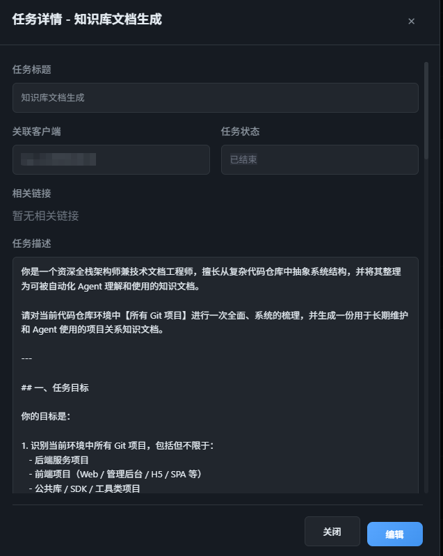

# 一、配置 knowledge.md

​	在文档仓库下创建知识库文档，路径为： {文档仓库}/init_docs/knowledge.md。客户端在执行的时候，如果存在 knowledge.md，会在 prompt 里面要求agent读取知识库文档，了解相关背景。

​	如何高效快速的创建知识库文档？直接在 AI任务管理界面提交一个任务，让agent自己阅读所有的项目，创建一个知识库文档，放到文档仓库下的： init_docs/knowledge.md

​	

# 二、配置 claude.md

​	在文档仓库下创建agent指导文档，路径为： {文档仓库}/init_docs/claude.md。客户端在执行的时候，会在 prompt 里面要求agent读取claude.md文档，并在按照相关规范进行操作。

​	如何高效快速的创建文档？和上面创建知识库文档一样，直接让 agent 自己写就好，放到文档仓库下的： init_docs/claude.md

# 三、配置 develop_plan_example.md

​	在文档仓库下创建开发文档样例，路径为： {文档仓库}/init_docs/develop_plan_example.md。客户端在执行的时候，会在 prompt 里面要求agent读取develop_plan_example.md文档，并参考这个样例文档来书写开发文档。

​	如何高效快速的创建文档？和上面创建知识库文档一样，直接让 agent 自己写就好，放到文档仓库下的： init_docs/develop_plan_example.md。